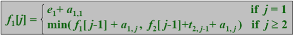
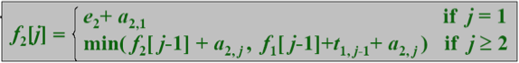
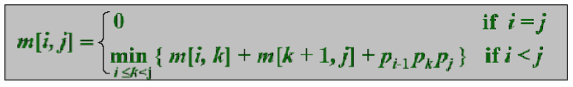
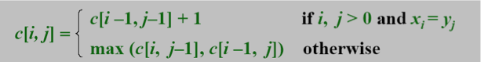
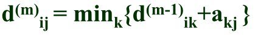
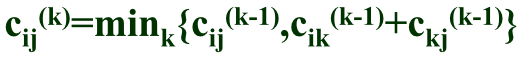

@
#算法导论复习提纲
自豪地采用`markdown`编写 - 作者:`hhj`

##题型
>1. **判断题 `8-10个`**
   概念，NP问题，nlogn = Ω(n)
2. **递归树**
   树根，$f(b/n)$，$b/n$，渐进紧致线
3. **求递推式的解**
   3个常规方法 + 主方法`必考`，`4.2-1考过原题`
4. **算法搭配`归类`**
   DP，贪心，分治，回溯，其他等
5. **各种排序算法**
   时间复杂度，空间复杂度，适应范围，最好时间，最坏时间，平均时间。
   归并，插入，快速，......计数排序等
6. **计算题`可能画图`**
   DP（矩阵链乘），贪心（背包，0-1背包，分数）
7. **算法设计题 `1-2个`**
   尽量给出递推式
8. **问答题（可能有）**
   分治，贪心，DP，回溯，哈夫曼编码等

-------------------

##知识体系结构

###一、 介绍部分
####1. 插入排序
>- 使用循环不变量`（loop-invariants）`证明正确性
- 计算内存模型`(RAM Model)`
- 最好情况`O(n)`，最坏和平均情况为`O(n2)`，空间复杂度为`O(1)`

####2. 分治`(Divide and Conquer)`
>- 一般方法
- **归并排序**
  最好最坏和平均都为`Θ(nlogn)`，空间复杂度为`O(n)`

####3. 分治算法分析
>- 递推方程
- **归并排序算法分析**
  由`递归树图`证明

-------------------
###二、 渐进增长
####1.  **渐进增长**
  > 上界`O符号`   等于`Ω符号`   下界`Θ符号`
  
####2.  解递推式
 >1. 代换法`(Substitution method)`
2. 递归树法`(Recursion-tree method)`
3. 主方法`(Master method 这货必考)`
  
-------------------
###三、 排序

####1.  堆排序`它不是一个稳定的排序`
> - Heaps
- **MAX-HEAPIFY** `O(lgn)` 使以i为根的子树成为最大堆
- **BUILD-MAX-HEAP** `O(n)` 对树中每一个其他节点都调用一次MAX-HEAPIFY
- **HEAPSORT** 堆排序算法，所有情况下均为`Θ(nlgn)`

####2.  优先级队列()
>- **MAXIMUM(S)** ： 返回S中具有最大关键字的元素
- **EXTRACT-MAX(S)**： 去掉并返回S中具有最大关键字的元素
- **INCREASE-KEY(S,x,k)**： 将元素x的值增加到k，k不能小于x原来的值。
- **INSERT(S, x)**： 把元素x插入集合S
- **一些应用**：`霍夫曼编码`，`迪杰斯特拉`

####3.  快速排序
>- 分治
- **PARTITION(A,p,r)**：对数组A[p..r]进行就地重排。
- **快速排序分析**：最差情况`Θ(n2) `,期望情况和最好情况`Θ(n lgn)` 空间复杂度`O(n)`
- **随机化的快速排序**

####4.  所有比较排序的最好最坏运行时间
>- 决策树模型
- `一个定理`：所有比较排序算法在最坏情况下需要`Ω(nlgn)`的运行时间。

-------------------
###四、 线性时间`(linear time)`的排序
####1. 计数排序`(Counting Sort)`
>- **如果在A中有17个不超过x的数怎么办？**
答：把最后一个放在第17个位置，倒数第二个放在第16个位置....
- 如果k=O(n)，**计数排序需要`Θ(n)`的时间**

####2. 基数排序`(Radix Sort)`
>- 从最低有效位的数字开始进行排序
- `Θ(dT(n))`,如果我们使用计数排序，并且d是连续的话，那就是`Θ(n)`

####2. 桶排序`(Bucket Sort)`
>- 把区间[0,1)划分为n个大小相等的子区间`(桶)`，然后把输入的数字分发到桶里区
- 在统一分配的情况下，时间复杂度为`Θ(n)`

-------------------
###五、 中位数`(Medians)`与顺序统计学`(Order Statistics)`
####1. 顺序统计学
>- 以期望线性时间做选择
   中心思想：`PARTITION`
   最差情况: `Θ(n2)`
- 最坏情况线性时间的选择
   递归地产生好的划分点
   
-------------------   
###六、 动态规划`(DP)`
####1. 生产线`(Assembly Lines)`
>

####2. 矩阵链乘问题`(Matrix-chain multiplication)`
>

####3. 动态规划的要素
>1. **最优子结构**`(Optimal Substructure)`
2. **重叠的子问题**`(Overlapping Subproblem)`
3. **重新构造一个最优解**`(Reconstructing an optimal solution)`
   3注：我们通常把子问题所做的选择保存在一个表中，在需要时候，可以拿出来用来**重构一个新的最优解**。
   
####4. 做备忘录`(Memoization)`

####5. 最长子序列问题`(LCS Longest Common Subsequence)`
>

####6. 最大和问题`(Max Sum)`
>$b[j]=max( b[j-1]+a[j], a[j] ), 1<=j<=n.$

------------------- 
###七、贪心`(Greedy)`
####1. 活动选择问题`(Activity-selection problem)`
>- 最优子结构
- 贪心算法

####2. 贪心策略`(Greedy strategy)`
>- 选择贪婪的属性和最有子结构
- 部分背包问题
- 0-1背包问题

####3. 哈夫曼编码`(Huffman codes)`

------------------- 
###七、单源最短路径
>- 非负权边
   迪杰斯特拉算法：`O(E+VlgV)`
- 可以有负权边
   Bellman-Ford德算法：`O(VE)`

------------------- 
###八. 每对顶点之间的最短路径
####1. 矩阵乘法式最短路径
>- 
- (min,+)乘法
- 改进的矩阵乘法算法

####2. 弗洛伊德算法`(Floyd-Warshall)`
>- 

####3. 稀疏图上的Johnson算法
>这个有点复杂 自己看书把

------------------- 
###九. 回溯`(Back Tracking)`
####1. 回溯模板
>- 是一种设计技巧，像分治法
- 适用于寻找优化问题的**可行解**
- 约束
  `显示约束`
  `隐式约束`
- 一般方法：弄出空间树 -> 生成问题状态 -> 是否为解状态? -> 是否为答案状态?
  使用`深度优先搜索`来寻找
 
####2. N皇后问题
>- 算法
- Bound函数

####3. 子集和问题
>- 解的形式，状态空间树
- Bound函数
- 最初的递归算法
- 改进的递归算法

####4. 0-1背包问题
>- 解的形式，状态空间树
- Bound函数
- 回溯算法

------------------- 
###十. 分支定界`(Branch and Bound)`
>- 分支定界算法
- 最小代价搜索`(Least Cost Search)`
  + 一般方法
  + 15 迷?`(15 puzzle)`
  
###十一. NP完全性`(N Polynomial complete)`
####1. 可计算性
>- 不可决定问题`(Undecidable Problem)`
   + 希尔伯特的第10个问题`(Hilbert’s 10th Problem)`
   + 波斯特对应问题`Post’s Correspondence Problem`
   + 停机问题`(Halting Problem)`
   
>- 图灵机`(Turing Machine)`
   + 图灵论题`(Church-Turing thesis)`
   + 通用图灵机`(Universal Turing Machine)`
   + 在原理上是否有可能写程序解决所有问题？
   
>- NP完全性
   + P, EXP, NP, NP完全性
   + SAT是第一个NP完全性问题
   + 其他NP完全性问题：3色问题，TSP问题，MIS问题
